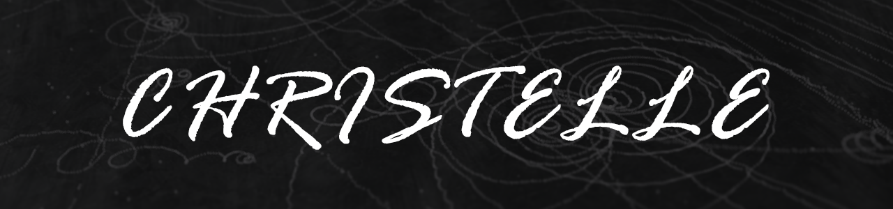

  

# Education

1. 🎓 **Bachelor's Degree in Physics**
   - Graduated in 2020
   - Focus on Electromagnetism, astrophysics and quantum mechanics
   - [Notre Dame University-Louaize](https://www.ndu.edu.lb/)

2. 🎓 **Master's Degree in Artificial Intelligence**
   - Graduated in 2024
   - Focus on machine learning algorithms, Statistical Inference, Big Data, Knowledge and Hybrid Systems, and NLP
   - [University of the West of England-Bristol](https://www.uwe.ac.uk/)

